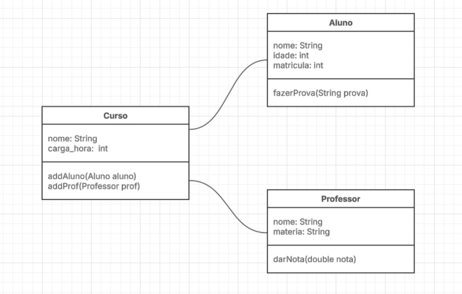

## ATIVIDADE 1
O excerto aborda o verdadeiro significado de "engenharia de software" e como esse conceito se distingue de "programação" ou "ciência da computação".  Ele destaca que, apesar de muitas vezes serem tratados como sinônimos, cada um desses conceitos tem um foco diferente.  A programação é mais voltada para escrever código, enquanto engenharia de software carrega a ideia de aplicar métodos, princípios e cuidados mais próximos dos usados em outras áreas da engenharia, como a mecânica ou a civil.

Além disso, o texto destaca que, embora o software seja menos tangível do que um avião ou uma ponte, ele já está tão integrado ao mundo real que deveria ser desenvolvido com o mesmo rigor. Outras engenharias possuem regras rígidas porque erros custam caro e à medida que o software se torna essencial no cotidiano, ele também precisa de processos mais cuidadosos e confiáveis.

Por fim, os autores explicam que a experiência do Google, por lidar com sistemas gigantes e complexos, oferece uma visão própria sobre como tornar o desenvolvimento de software mais profissional e robusto. O objetivo do livro é justamente ajudar a aproximar o desenvolvimento de software de práticas realmente engenheiradas.

## ATIVIDADE 2
O trecho esclarece que a engenharia de software vai além da simples escrita de código; ela também envolve a gestão de todos os processos e ferramentas que garantem a utilidade e o bom funcionamento desse código ao longo do tempo.  Os autores destacam que o desafio não é apenas criar algo, mas garantir que o software seja sustentável, fácil de ajustar e capaz de acompanhar mudanças inevitáveis.  Eles reconhecem que não possuem respostas definitivas, porém creem que a experiência do Google pode contribuir para indicar direções para práticas mais robustas.

Uma ideia central é que a engenharia de software pode ser vista como "programação ao longo do tempo", o que realmente importa é como o código se comporta ao longo de sua vida útil desde a sua criação, passando pela manutenção, até o eventual descarte.  Além disso, o texto enfatiza que, para fazer isso corretamente, é fundamental compreender que o código precisa evoluir ao longo do tempo, que a organização deve acompanhar seu próprio desenvolvimento e que todas as escolhas técnicas implicam custos e compensações.

## ATIVIDADE 3
### Tempo de entrega x Qualidade de código
Em desenvolvimento de software, quanto mais rápido você quer entregar, maior a tendência de sacrificar qualidade (testes, documentação, arquitetura bem pensada).
Por outro lado, investir em alta qualidade geralmente exige mais tempo, revisões, testes, padrões, refatoração, o que pode atrasar lançamentos.
- Por muitos anos, o Facebook usou o lema “Move fast and break things”, indicando que entregar rápido era prioridade absoluta, mesmo que isso gerasse bugs ou falhas temporárias.

### Escalabilidade x Custo inicial
Criar um sistema altamente escalável (capaz de suportar milhares ou milhões de usuários) geralmente é caro no início, exige mais infraestrutura, tecnologias mais robustas, automações, arquiteturas distribuídas etc.
Por outro lado, optar por algo barato hoje (monolito simples, servidor único) pode gerar limitações quando o produto crescer.
- No começo, o Twitter foi construído de forma simples e barata, focado em validar a ideia.
O problema: o crescimento explosivo chegou muito antes do esperado.

### Padronização x Flexibilidade
Padronizar código, processos e ferramentas aumenta qualidade, previsibilidade e manutenção.
Mas mais padrões significam menos liberdade para experimentar, adaptar ou adotar soluções alternativas.
- O Google é um exemplo claro do trade-off entre padronização e flexibilidade. Para manter milhares de engenheiros trabalhando de forma coordenada em produtos gigantescos como YouTube, Maps e Gmail, a empresa adota padrões extremamente rígidos: um único repositório de código, ferramentas internas próprias, guias de estilo obrigatórios e processos formais de revisão. Isso garante consistência, qualidade e facilidade de manutenção, mas reduz a liberdade dos times para experimentar novas tecnologias ou adotar ferramentas diferentes das oficiais.

## ATIVIDADE 4

## ATIVIDADE 5 E 6
[Pasta: curso-exemplo](curso-exemplo)

## ATIVIDADE 7
[Pasta: biblioteca-exemplo](biblioteca-exemplo)

## ATIVIDADE 8
[Pasta: chat-ollama](chat-ollama)
