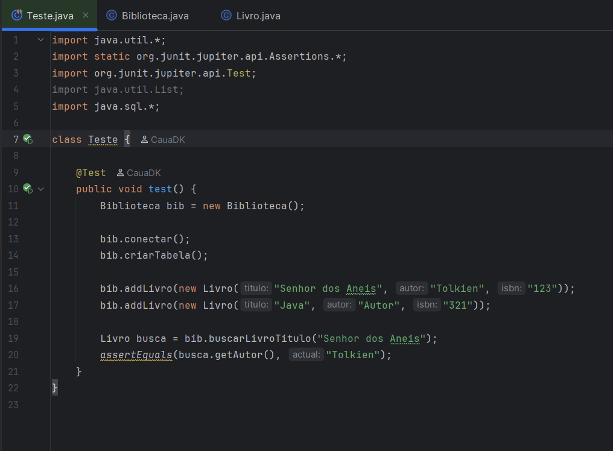
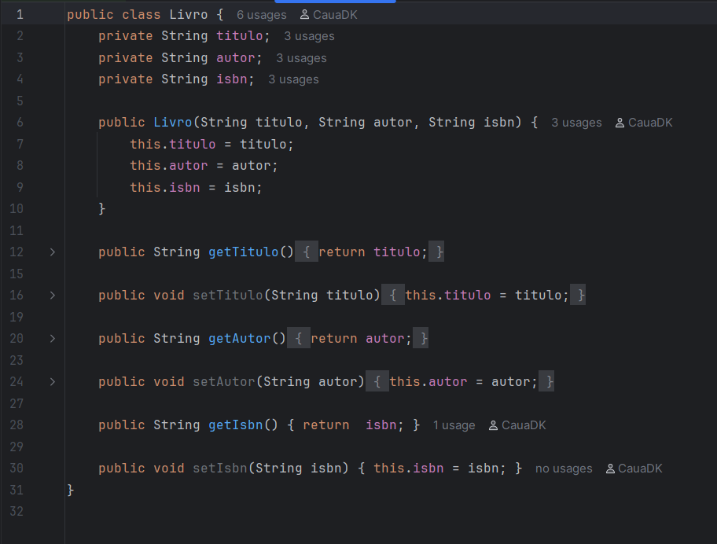
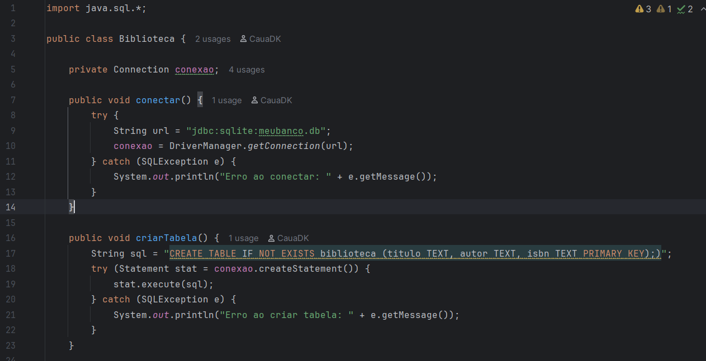
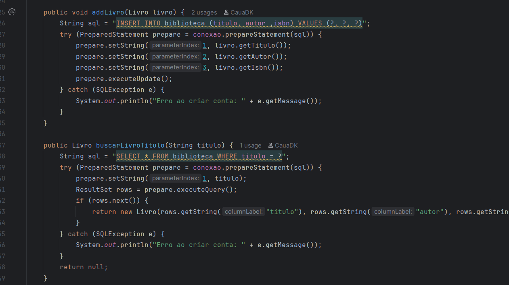

## BIBLIOTECA-EXEMPLO

Um sistema para adicionar livros e fazer uma busca neles.

Foi utilizado um banco de dados sqlite para incrementar os livros.

## classe teste

## classe livro

## classe biblioteca

---

