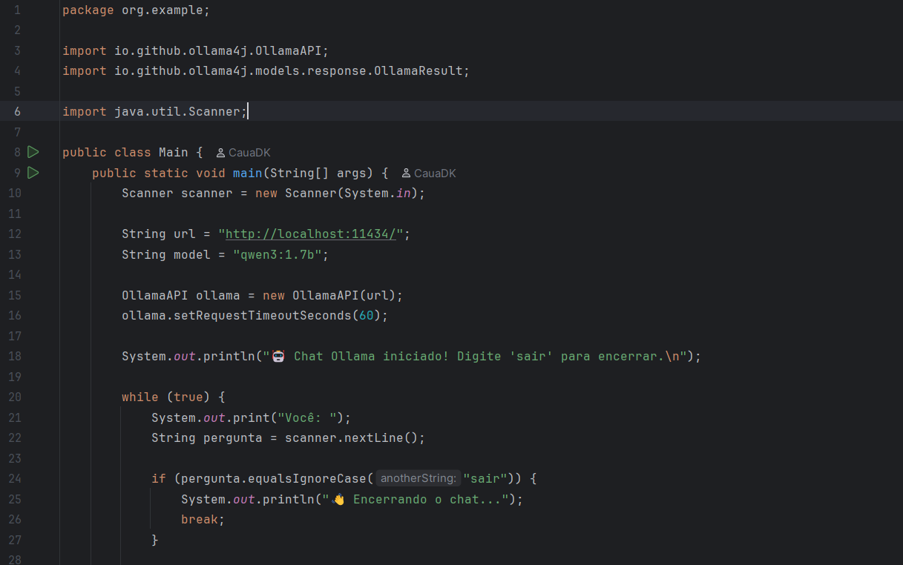
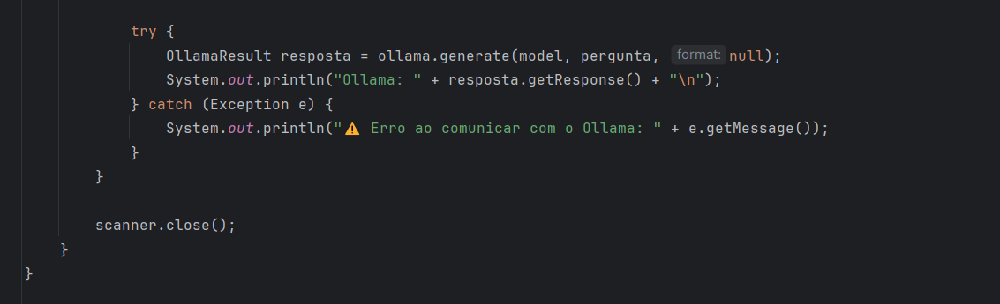

## CHAT-OLLAMA

Um sistema simples de conversa com uma IA

Utilizando a biblioteca Ollama para java

Funciona como qualquer outra IA basta fazer uma pergunta para obter respostas

## classe main

---

